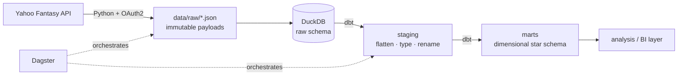

# Fantasy Football Analytics Pipeline

End-to-end analytics pipeline over a single private Yahoo Fantasy Football league's
history — Python ingestion, DuckDB warehouse, dbt dimensional models, Dagster
orchestration, tested in CI.

> **Status:** in active development. Ingestion layer is functional; modeling layer
> in progress. This is a personal learning and portfolio project.

---

## Why this exists

Yahoo's fantasy UI shows you what happened. It doesn't let you ask why. It won't tell
you how many points a manager left on the bench across a season, whether a draft pick
returned its cost, or which managers consistently win the matchups they should lose.

Answering those questions requires the data modeled properly, not another dashboard on
top of a flat export. So this project builds the whole stack — extraction, storage,
transformation, testing, orchestration — with the reasoning behind each choice
documented rather than assumed.

## Architecture



## Stack

| Layer | Choice | Why |
|---|---|---|
| Ingestion | Python + `requests` | No SDK — SDKs return parsed objects, which destroys the raw payload before it lands |
| Raw storage | JSON on local disk | Immutable, replayable, auditable; completed seasons are never re-fetched |
| Warehouse | DuckDB | Zero cost, zero credentials, zero bill risk; dbt keeps the SQL portable to BigQuery or Snowflake |
| Transformation | dbt-core + dbt-duckdb | Version-controlled, tested, documented models with real lineage |
| Orchestration | Dagster (OSS) | Asset-based model maps cleanly onto dbt models — one lineage graph end to end |
| CI | GitHub Actions | Runs `dbt build` on every PR so a broken model never reaches `main` |

Every component is free. No managed service, no billing account, no cloud spend.

## Data model

Four layers, each with exactly one job:

```
data/raw/*.json   →   raw.*   →   stg_*   →   marts
 landed payloads      DuckDB     flatten     dimensional
 (gitignored)                    type/rename
```

Planned marts:

| Model | Grain |
|---|---|
| `dim_manager` | one row per human, tracked across seasons and team-name changes |
| `dim_team_season` | league_key + team_id |
| `dim_player` | player_key |
| `fct_roster_slot` | league_key + week + team + player |
| `fct_matchup` | league_key + week + team |
| `fct_draft_pick` | league_key + pick_number |
| `fct_transaction` | transaction_id + player |

`fct_roster_slot` is the atomic fact. Because it records started-vs-benched at the
player-week grain, everything else — weekly scores, season totals, optimal-lineup
analysis, manager decision quality — rolls up from it rather than being computed
separately. Getting that grain right is the central modeling decision in the project.

## Data handling

- No Yahoo Fantasy data is committed to this repository. `data/raw/` is gitignored.
- No credentials are committed. `.env` and `.secrets/` are gitignored.
- API access is **read-only**. This project never writes to any Yahoo league.
- Data covers one private league the author plays in, is stored locally, and is not
  redistributed, resold, or published.

## Setup

Requires a Yahoo Developer app with Fantasy Sports API access (now granted by
application at `sports.yahoo.com/developer/access`).

```bash
python -m venv .venv && source .venv/bin/activate
pip install -r requirements.txt

cp .env.example .env          # add your Client ID and Secret
python -m src.ingest.yahoo_client auth   # one-time OAuth handshake
python -m src.ingest.discover            # enumerate league history
```

## Roadmap

- [x] OAuth2 handshake with persistent refresh
- [x] Raw landing layer with idempotent fetch
- [ ] Multi-season backfill across all league history
- [ ] dbt staging models over the raw JSON
- [ ] Dimensional marts + dbt tests on every grain
- [ ] Dagster assets wrapping ingestion and dbt
- [ ] CI running `dbt build` on pull requests
- [ ] Analysis layer

## License

MIT
