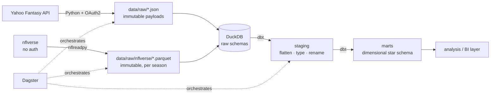

# Fantasy Football Analytics Pipeline

End-to-end analytics pipeline over a single private Yahoo Fantasy Football league's
history, joined against public NFL data — Python ingestion, DuckDB warehouse, dbt
dimensional models, Dagster orchestration, tested in CI.

> **Status:** in active development. The nflverse source runs end to end — ingestion,
> warehouse load, tested dbt staging models and marts (`dim_player`, `dim_game`,
> `fct_player_week`), Dagster assets. A player ID crosswalk (including Yahoo IDs) is
> also landed, ahead of the Yahoo join it exists to support. The Yahoo source itself
> is ingestion-complete but its modeling is blocked on API access review. The marts
> that join the two sources come next. Personal learning and portfolio project.

---

## Why this exists

Yahoo's fantasy UI shows you what happened. It doesn't let you ask why. It won't tell
you how many points a manager left on the bench across a season, whether a draft pick
returned its cost, or which managers consistently win the matchups they should lose.

Answering those questions requires the data modeled properly, not another dashboard on
top of a flat export. So this project builds the whole stack — extraction, storage,
transformation, testing, orchestration — with the reasoning behind each choice
documented rather than assumed.

## Architecture


```mermaid
flowchart LR
    A[Yahoo Fantasy API] -->|Python + OAuth2| B[data/raw/*.json<br/>immutable payloads]
    A2[nflverse<br/>no auth] -->|nflreadpy| B2[data/raw/nflverse/*.parquet<br/>immutable, per season]
    B --> C[(DuckDB<br/>raw schemas)]
    B2 --> C
    C -->|dbt| D[staging<br/>flatten · type · rename]
    D -->|dbt| E[marts<br/>dimensional star schema]
    E --> F[analysis / BI layer]
    G[Dagster] -.orchestrates.-> B
    G -.orchestrates.-> B2
    G -.orchestrates.-> D
```

Two sources, permanently. Yahoo knows what *this league* did — who drafted whom, who
started whom, who won. nflverse knows what the *players* did — real NFL box scores,
schedules, opponents. Neither answers "was that start/sit call defensible?" alone.

## Stack

| Layer | Choice | Why |
|---|---|---|
| Ingestion (Yahoo) | Python + `requests` | No SDK — SDKs return parsed objects, which destroys the raw payload before it lands |
| Ingestion (nflverse) | `nflreadpy` | The maintained successor to the deprecated `nfl_data_py`; free, no API key |
| Raw storage | Each source's native format on local disk | JSON for Yahoo, parquet for nflverse — re-encoding either would discard payload shape or column types |
| Warehouse | DuckDB | Zero cost, zero credentials, zero bill risk; dbt keeps the SQL portable to BigQuery or Snowflake |
| Transformation | dbt-core + dbt-duckdb | Version-controlled, tested, documented models with real lineage |
| Orchestration | Dagster (OSS) | Asset-based model maps cleanly onto dbt models — one lineage graph end to end |
| CI | GitHub Actions | Runs `dbt build` on every PR so a broken model never reaches `main` |

Every component is free. No managed service, no billing account, no cloud spend.

## Data model

Four layers, each with exactly one job:

```
data/raw/   →   raw_*.*   →   stg_*   →   marts
 landed          DuckDB      flatten     dimensional
 (gitignored)                type/rename
```

Built today (real SQL, 38/38 dbt tests passing against real data):

| Model | Layer | Grain | Rows |
|---|---|---|---|
| `stg_nflverse__player_stats_weekly` | staging | player + season + week + season_type | 112,319 |
| `stg_nflverse__schedules` | staging | game_id | 1,693 |
| `stg_nflverse__player_id_crosswalk` | staging | player_id | ~4,000 (deduped) |
| `dim_player` | mart | player_id | 4,061 |
| `dim_game` | mart | game_id | 1,693 |
| `fct_player_week` | mart | player_id + season + week + season_type | 112,319 |

`fct_player_week` is the atomic fact on the nflverse side — real NFL production,
independent of any fantasy league. `dim_player` carries a nullable `yahoo_id` sourced
from the player ID crosswalk specifically so the Yahoo side can eventually join onto
it by ID rather than by name-matching.

Planned marts (Yahoo side, blocked on API access):

| Model | Grain |
|---|---|
| `dim_manager` | one row per human, tracked across seasons and team-name changes |
| `dim_team_season` | league_key + team_id |
| `fct_roster_slot` | league_key + week + team + player |
| `fct_matchup` | league_key + week + team |
| `fct_draft_pick` | league_key + pick_number |
| `fct_transaction` | transaction_id + player |

`fct_roster_slot` will be the atomic fact on the Yahoo side — what a team actually
rostered, started, and scored — the counterpart to `fct_player_week`'s "what actually
happened on the field." The join between them, once both exist, is what answers this
project's central question: was a given start/sit call defensible given the matchup?

## Data handling

- No Yahoo Fantasy data is committed to this repository. `data/raw/` is gitignored.
- No credentials are committed. `.env` and `.secrets/` are gitignored.
- API access is **read-only**. This project never writes to any Yahoo league.
- Data covers one private league the author plays in, is stored locally, and is not
  redistributed, resold, or published.

## Setup

Requires a Yahoo Developer app with Fantasy Sports API access (now granted by
application at `sports.yahoo.com/developer/access`).

```bash
python -m venv .venv && source .venv/bin/activate
pip install -r requirements.txt

cp .env.example .env          # add your Client ID and Secret
python -m src.ingest.yahoo_client auth   # one-time OAuth handshake
python -m src.ingest.discover            # enumerate league history
```

The nflverse half needs no credentials at all:

```bash
python -m src.ingest.nflverse            # land parquet, 2020 -> current season
python -m src.load.duckdb_raw            # load into DuckDB as raw_nflverse.*
dbt build --project-dir transform --profiles-dir transform
```

## Roadmap

- [x] OAuth2 handshake with persistent refresh
- [x] Raw landing layer with idempotent fetch
- [x] Second data source: nflverse player stats + schedules, 2020-present
- [x] Player ID crosswalk landed (nflverse <-> Yahoo <-> ESPN <-> Sleeper), ahead of
      the Yahoo join it exists to support
- [x] dbt staging models over nflverse, tested on real data
- [x] Dimensional marts over nflverse: `dim_player`, `dim_game`, `fct_player_week`
- [x] Dagster assets wrapping ingestion and dbt in one lineage graph
- [x] CI running `dbt build` on pull requests, against real nflverse data
- [ ] Multi-season Yahoo backfill (blocked: API access pending review)
- [ ] dbt staging models over the raw Yahoo JSON
- [ ] Dimensional marts over Yahoo, joined to the nflverse side via `yahoo_id`
- [ ] Analysis layer

## License

MIT
